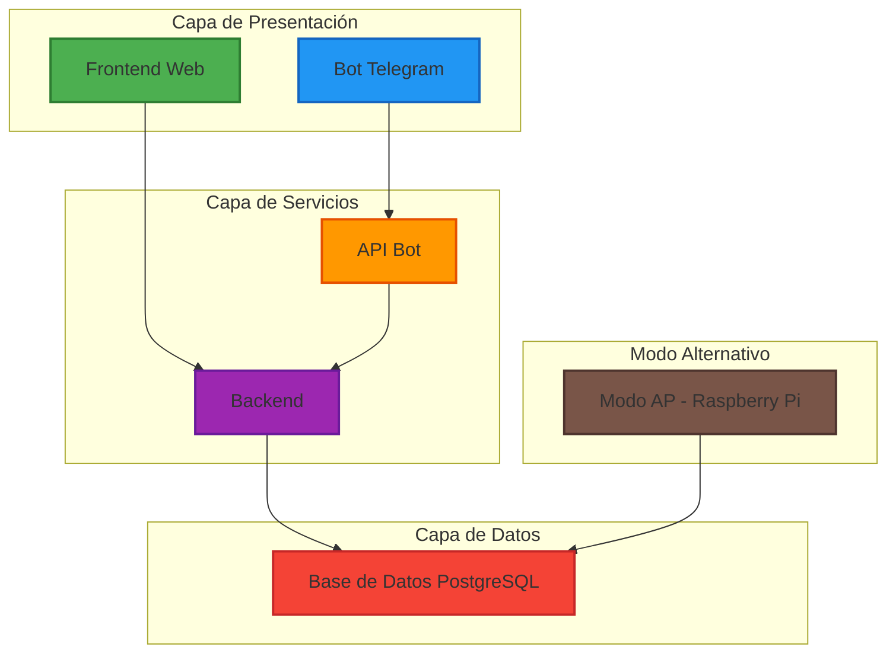
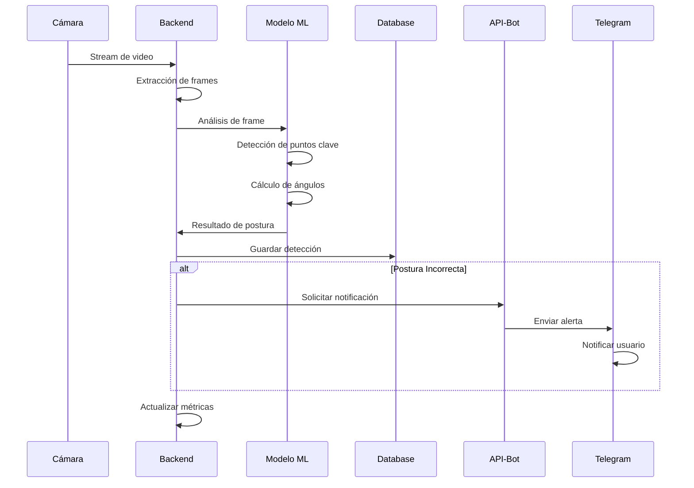
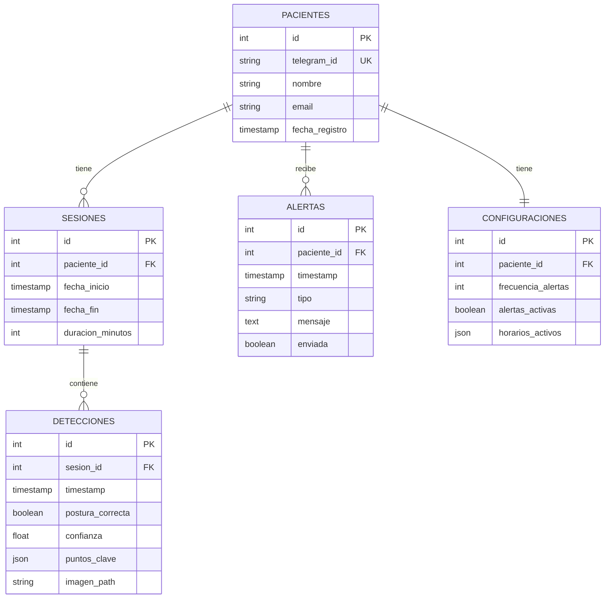

# DOCUMENTACIÓN TÉCNICA COMPLETA - SISTEMA SHPD
## Smart Healthy Posture Detector

---

## 1. INTRODUCCIÓN GENERAL

### 1.1 Objetivo del Sistema SHPD

El Sistema SHPD (Smart Healthy Posture Detector) es una solución integral diseñada para detectar, monitorear y corregir posturas corporales inadecuadas en tiempo real. Este sistema utiliza técnicas de visión por computadora, aprendizaje automático y arquitecturas distribuidas para proporcionar retroalimentación continua a los usuarios sobre su postura corporal, contribuyendo así a la prevención de problemas musculoesqueléticos asociados con malas posturas prolongadas.

### 1.2 Alcance del Proyecto

Este proyecto de tesis abarca el diseño, desarrollo e implementación de un sistema completo de detección de postura que incluye:

- Captura y procesamiento de imágenes en tiempo real
- Análisis de postura mediante algoritmos de inteligencia artificial
- Interfaz de usuario web para visualización de métricas
- Bot de Telegram para notificaciones y alertas
- Base de datos para almacenamiento histórico
- Modo de operación autónomo para dispositivos embebidos

### 1.3 Información del Proyecto

- **Autor**: Rodolfo Giacomodonatto
- **Carrera**: Ingeniería Electrónica
- **Universidad**: Universidad Tecnológica Nacional (UTN)
- **Año**: 2024

---

## 2. ARQUITECTURA GENERAL DEL SISTEMA

### 2.1 Diagrama de Arquitectura



### 2.2 Flujo de Información

El sistema SHPD sigue un flujo de información distribuido:

1. **Captura de Datos**: Los dispositivos de captura (cámaras web o cámaras integradas) obtienen frames de video del usuario
2. **Procesamiento**: El backend procesa los frames utilizando modelos de detección de postura
3. **Almacenamiento**: Los resultados se almacenan en la base de datos PostgreSQL
4. **Notificaciones**: El API Bot envía alertas a través del Bot de Telegram cuando se detectan posturas incorrectas
5. **Visualización**: El frontend muestra métricas y estadísticas en tiempo real
6. **Modo Autónomo**: El modo AP permite operación sin conexión a internet

### 2.3 Tecnologías Principales

- **Orquestación**: Kubernetes (Kind para desarrollo local)
- **Contenedores**: Docker
- **Backend**: Python, FastAPI
- **Base de Datos**: PostgreSQL 15
- **Mensajería**: Telegram Bot API
- **Frontend**: (Por implementar)
- **Ingress**: NGINX Ingress Controller

---

## 3. DESCRIPCIÓN TÉCNICA DE CADA MÓDULO

### 3.1 API-BOT

#### Propósito del Módulo
El módulo `api-bot` actúa como puente entre el sistema de detección de postura y el bot de Telegram, permitiendo el envío de notificaciones y reportes a los usuarios.

#### Estructura de Archivos
```
api-bot/
├── Dockerfile
├── bot_api.py
├── requirements.txt
└── deploy/
    ├── api-deploy.yaml
    └── bot-svc.yaml
```

#### Tecnologías Usadas
- **Python 3.10**: Lenguaje de programación principal
- **FastAPI**: Framework web moderno y de alto rendimiento
- **python-telegram-bot**: Librería para interactuar con la API de Telegram
- **Uvicorn**: Servidor ASGI para aplicaciones Python

#### Funcionamiento Detallado

El servicio expone un endpoint REST `/send_report` que recibe solicitudes POST con la siguiente estructura:

```python
{
    "telegram_id": "ID_del_usuario",
    "resumen": "Resumen HTML del reporte de postura"
}
```

El servicio procesa la solicitud y envía el mensaje al usuario a través del bot de Telegram configurado.

#### Integración con Otros Módulos
- Recibe solicitudes del backend cuando se necesita enviar notificaciones
- Se comunica directamente con la API de Telegram
- Desplegado como un servicio independiente en Kubernetes

#### Comandos de Instalación y Ejecución

```bash
# Construcción de imagen Docker
cd api-bot
docker build -t api-bot:1.0.0 .

# Ejecución local
pip install -r requirements.txt
uvicorn bot_api:app --host 0.0.0.0 --port 8000

# Despliegue en Kubernetes
kubectl apply -f deploy/
```

### 3.2 BACKEND

#### Propósito del Módulo
El backend es el núcleo del sistema SHPD, responsable del procesamiento de imágenes, detección de posturas, gestión de WebSocket para comunicación en tiempo real y exposición de APIs para el frontend.

#### Estructura Planeada
```
backend/
├── Dockerfile
├── main.py
├── requirements.txt
├── models/
│   └── posture_detection.py
├── services/
│   ├── image_processing.py
│   └── websocket_handler.py
├── routers/
│   └── api_routes.py
└── deploy/
    └── backend-deploy.yaml
```

#### Tecnologías Esperadas
- **OpenCV**: Procesamiento de imágenes
- **MediaPipe/OpenPose**: Detección de puntos clave del cuerpo
- **TensorFlow/PyTorch**: Modelos de clasificación de postura
- **WebSocket**: Comunicación en tiempo real
- **FastAPI**: Framework web

#### Funcionamiento Planeado
1. Recepción de streams de video a través de WebSocket
2. Extracción de frames y preprocesamiento
3. Detección de puntos clave del cuerpo humano
4. Análisis de ángulos y distancias para determinar la postura
5. Clasificación de la postura (correcta/incorrecta)
6. Generación de métricas y alertas
7. Comunicación con la base de datos y el servicio de notificaciones

### 3.3 BOT

#### Propósito del Módulo
El bot de Telegram proporciona una interfaz conversacional para que los usuarios interactúen con el sistema SHPD, reciban notificaciones y consulten su historial.

#### Estructura Esperada
```
bot/
├── Dockerfile
├── bot.py
├── requirements.txt
├── handlers/
│   ├── start_handler.py
│   ├── report_handler.py
│   └── settings_handler.py
└── deploy/
    └── bot-deploy.yaml
```

#### Funcionalidades Planeadas
- **Comandos básicos**: /start, /help, /status
- **Configuración de alertas**: Frecuencia y tipos de notificaciones
- **Consulta de reportes**: Historial de posturas
- **Estadísticas**: Resúmenes diarios/semanales
- **Configuración de perfil**: Datos del usuario

### 3.4 DATABASE

#### Propósito del Módulo
Gestiona el almacenamiento persistente de todos los datos del sistema, incluyendo usuarios, sesiones de monitoreo, detecciones de postura y configuraciones.

#### Estructura de Archivos
```
database/
├── Dockerfile
├── main.py
├── requirements.txt
└── deploy/
    ├── database-svc.yaml
    ├── persistentVolumeClaim.yaml
    └── shpd-database.yaml
```

#### Tecnologías Usadas
- **PostgreSQL 15**: Sistema de gestión de base de datos
- **SQLAlchemy**: ORM para Python
- **FastAPI**: Para exponer API de acceso a datos
- **Asyncpg**: Driver asíncrono para PostgreSQL

#### Estructura de Base de Datos (Esperada)

```sql
-- Tabla de Pacientes/Usuarios
CREATE TABLE pacientes (
    id SERIAL PRIMARY KEY,
    telegram_id VARCHAR(50) UNIQUE,
    nombre VARCHAR(100),
    email VARCHAR(100),
    fecha_registro TIMESTAMP DEFAULT CURRENT_TIMESTAMP
);

-- Tabla de Sesiones de Monitoreo
CREATE TABLE sesiones (
    id SERIAL PRIMARY KEY,
    paciente_id INTEGER REFERENCES pacientes(id),
    fecha_inicio TIMESTAMP,
    fecha_fin TIMESTAMP,
    duracion_minutos INTEGER
);

-- Tabla de Detecciones de Postura
CREATE TABLE detecciones (
    id SERIAL PRIMARY KEY,
    sesion_id INTEGER REFERENCES sesiones(id),
    timestamp TIMESTAMP,
    postura_correcta BOOLEAN,
    confianza FLOAT,
    puntos_clave JSONB,
    imagen_path VARCHAR(255)
);

-- Tabla de Alertas
CREATE TABLE alertas (
    id SERIAL PRIMARY KEY,
    paciente_id INTEGER REFERENCES pacientes(id),
    timestamp TIMESTAMP,
    tipo VARCHAR(50),
    mensaje TEXT,
    enviada BOOLEAN DEFAULT FALSE
);
```

#### Integración
- Expone API REST para operaciones CRUD
- Utiliza conexiones asíncronas para mejor rendimiento
- Implementa respaldo automático mediante PersistentVolumeClaim

### 3.5 FRONTEND

#### Propósito del Módulo
Proporciona una interfaz web intuitiva para visualización de datos en tiempo real, configuración del sistema y análisis de métricas históricas.

#### Estructura Esperada
```
frontend/
├── Dockerfile
├── package.json
├── public/
├── src/
│   ├── components/
│   │   ├── Dashboard.jsx
│   │   ├── LiveMonitor.jsx
│   │   └── Reports.jsx
│   ├── services/
│   └── App.js
└── deploy/
    └── frontend-deploy.yaml
```

#### Tecnologías Planeadas
- **React/Vue.js**: Framework de frontend
- **WebSocket Client**: Para comunicación en tiempo real
- **Chart.js/D3.js**: Visualización de datos
- **Material-UI/Tailwind**: Framework de diseño

#### Funcionalidades Esperadas
1. **Dashboard Principal**
   - Métricas en tiempo real
   - Estado actual de la postura
   - Alertas recientes

2. **Monitor en Vivo**
   - Stream de video con overlay de detección
   - Indicadores visuales de postura
   - Retroalimentación inmediata

3. **Reportes y Análisis**
   - Gráficos de tendencias
   - Historial de sesiones
   - Exportación de datos

### 3.6 MODO-AP (Modo Access Point)

#### Propósito del Módulo
Permite la operación del sistema SHPD en modo autónomo sin conexión a internet, ideal para implementaciones en Raspberry Pi o dispositivos embebidos.

#### Estructura Esperada
```
modo-ap/
├── Dockerfile
├── setup_ap.sh
├── main.py
├── config/
│   ├── hostapd.conf
│   └── dhcpd.conf
└── deploy/
    └── modo-ap-deploy.yaml
```

#### Características del Modo AP
- Crea un punto de acceso WiFi local
- Ejecuta versión simplificada del sistema
- Almacenamiento local con sincronización posterior
- Interfaz web minimalista
- Procesamiento optimizado para hardware limitado

---

## 4. FLUJO DE DATOS Y LÓGICA DE DETECCIÓN

### 4.1 Pipeline de Procesamiento



### 4.2 Algoritmo de Detección de Postura

1. **Captura de Frame**: Obtención de imagen de la cámara
2. **Preprocesamiento**: Normalización y redimensionamiento
3. **Detección de Puntos Clave**: Identificación de articulaciones principales
4. **Cálculo de Ángulos**: Medición de ángulos entre segmentos corporales
5. **Clasificación**: Comparación con patrones de postura correcta
6. **Generación de Score**: Puntuación de 0-100 de calidad postural

### 4.3 Criterios de Alerta

- **Alerta Inmediata**: Postura incorrecta por más de 30 segundos
- **Alerta Acumulativa**: Más del 60% del tiempo en mala postura
- **Alerta Preventiva**: Recordatorios periódicos configurables

---

## 5. BOT DE TELEGRAM

### 5.1 Funciones Principales

#### Comandos Disponibles
- `/start` - Inicialización y registro del usuario
- `/help` - Lista de comandos disponibles
- `/status` - Estado actual de monitoreo
- `/report` - Reporte del día actual
- `/weekly` - Resumen semanal
- `/settings` - Configuración de notificaciones
- `/pause` - Pausar monitoreo temporalmente
- `/resume` - Reanudar monitoreo

### 5.2 Flujo de Conversación

```
Usuario: /start
Bot: ¡Bienvenido al Sistema SHPD! 🤖
     Para comenzar, necesito algunos datos...
     ¿Cuál es tu nombre?

Usuario: [nombre]
Bot: Perfecto [nombre], ahora configuremos tus preferencias de notificación...
```

### 5.3 Configuración y Restricciones

- Autenticación mediante telegram_id único
- Límite de notificaciones por hora configurable
- Horarios de no molestar
- Idioma: Español (extensible a otros idiomas)

---

## 6. BASE DE DATOS

### 6.1 Modelo Entidad-Relación



### 6.2 Consultas Principales

```sql
-- Obtener resumen diario de un usuario
SELECT 
    COUNT(*) as total_detecciones,
    SUM(CASE WHEN postura_correcta THEN 1 ELSE 0 END) as posturas_correctas,
    AVG(confianza) as confianza_promedio
FROM detecciones d
JOIN sesiones s ON d.sesion_id = s.id
WHERE s.paciente_id = ? 
AND DATE(d.timestamp) = CURRENT_DATE;

-- Tendencia semanal
SELECT 
    DATE(d.timestamp) as fecha,
    AVG(CASE WHEN postura_correcta THEN 100 ELSE 0 END) as porcentaje_correcto
FROM detecciones d
JOIN sesiones s ON d.sesion_id = s.id
WHERE s.paciente_id = ?
AND d.timestamp >= CURRENT_DATE - INTERVAL '7 days'
GROUP BY DATE(d.timestamp)
ORDER BY fecha;
```

---

## 7. FRONTEND

### 7.1 Interfaz de Usuario

#### Dashboard Principal
- **Widget de Estado Actual**: Indicador visual grande con color (verde/amarillo/rojo)
- **Gráfico de Tendencia**: Línea temporal de las últimas 24 horas
- **Métricas Clave**: 
  - Tiempo total monitoreado
  - Porcentaje de postura correcta
  - Número de alertas generadas
  - Racha de buena postura

#### Vista de Monitoreo en Vivo
- Video stream con overlay de esqueleto detectado
- Indicadores en tiempo real de ángulos críticos
- Barra de progreso de sesión actual
- Botones de control (pausar/reanudar)

### 7.2 Comunicación con Backend

```javascript
// Conexión WebSocket para datos en tiempo real
const ws = new WebSocket('ws://backend-service:8000/ws');

ws.onmessage = (event) => {
    const data = JSON.parse(event.data);
    updateDashboard(data);
    
    if (data.alertRequired) {
        showVisualAlert(data.message);
    }
};

// API REST para datos históricos
async function fetchDailyReport() {
    const response = await fetch('/api/reports/daily');
    const data = await response.json();
    renderReport(data);
}
```

---

## 8. MODO AP (MODO AUTÓNOMO)

### 8.1 Propósito y Casos de Uso

El Modo AP está diseñado para:
- Operación sin conexión a internet
- Implementación en lugares remotos
- Uso en dispositivos embebidos (Raspberry Pi)
- Aplicaciones de bajo costo

### 8.2 Diferencias con Modo Regular

| Característica | Modo Regular | Modo AP |
|----------------|--------------|---------|
| Conexión Internet | Requerida | No requerida |
| Notificaciones | Telegram | Local/LED |
| Base de Datos | PostgreSQL remota | SQLite local |
| Interfaz | Web completa | Web minimalista |
| Procesamiento | Servidor potente | Optimizado para ARM |
| Actualizaciones | Automáticas | Manual |

### 8.3 Configuración Raspberry Pi

```bash
#!/bin/bash
# Setup script para Modo AP

# Configurar punto de acceso
sudo apt-get install hostapd dnsmasq
sudo systemctl stop hostapd
sudo systemctl stop dnsmasq

# Configurar IP estática
sudo echo "interface wlan0
    static ip_address=192.168.4.1/24
    nohook wpa_supplicant" >> /etc/dhcpcd.conf

# Iniciar servicios
sudo systemctl unmask hostapd
sudo systemctl enable hostapd
sudo systemctl start hostapd
```

---

## 9. INSTRUCCIONES DE INSTALACIÓN Y DESPLIEGUE

### 9.1 Requisitos Previos

- **Docker**: Versión 20.10 o superior
- **Kubernetes**: Kind o cluster K8s
- **Python**: 3.10 o superior
- **Node.js**: 16.x o superior (para frontend)
- **PostgreSQL**: 15 (si se ejecuta localmente)

### 9.2 Instalación para Entorno Local

```bash
# 1. Clonar repositorio
git clone https://github.com/usuario/shpd-all.git
cd shpd-all

# 2. Crear cluster Kubernetes local
./script.sh

# 3. Construir imágenes Docker
docker build -t shpd/api-bot:1.0.0 ./api-bot
docker build -t shpd/database:1.0.0 ./database
docker build -t shpd/backend:1.0.0 ./backend
docker build -t shpd/frontend:1.0.0 ./frontend
docker build -t shpd/bot:1.0.0 ./bot

# 4. Cargar imágenes en Kind
kind load docker-image shpd/api-bot:1.0.0 --name=rodo
kind load docker-image shpd/database:1.0.0 --name=rodo
# ... repetir para todas las imágenes

# 5. Aplicar manifiestos
kubectl apply -f database/deploy/
kubectl apply -f api-bot/deploy/
kubectl apply -f backend/deploy/
kubectl apply -f frontend/deploy/
kubectl apply -f bot/deploy/

# 6. Verificar estado
kubectl get pods
kubectl get services
```

### 9.3 Instalación en Raspberry Pi

```bash
# 1. Preparar sistema
sudo apt update && sudo apt upgrade -y
sudo apt install python3-pip python3-venv git

# 2. Clonar y configurar
git clone https://github.com/usuario/shpd-all.git
cd shpd-all/modo-ap

# 3. Crear entorno virtual
python3 -m venv venv
source venv/bin/activate

# 4. Instalar dependencias
pip install -r requirements.txt

# 5. Configurar modo AP
sudo ./setup_ap.sh

# 6. Iniciar servicio
python main.py
```

### 9.4 Variables de Entorno

```env
# Base de Datos
POSTGRES_HOST=postgres-service
POSTGRES_PORT=5432
POSTGRES_DB=shpd_db
POSTGRES_USER=user
POSTGRES_PASSWORD=password

# Telegram
TELEGRAM_TOKEN=your_telegram_bot_token

# Backend
BACKEND_PORT=8000
WEBSOCKET_PORT=8001

# Frontend
REACT_APP_BACKEND_URL=http://backend-service:8000
REACT_APP_WS_URL=ws://backend-service:8001
```

---

## 10. CONSIDERACIONES FINALES

### 10.1 Conclusiones de Diseño

El sistema SHPD representa una solución integral para el monitoreo de postura corporal, combinando tecnologías modernas de visión por computadora con arquitecturas distribuidas escalables. Las decisiones de diseño principales incluyen:

1. **Arquitectura de Microservicios**: Permite escalabilidad y mantenimiento independiente
2. **Uso de Kubernetes**: Facilita el despliegue y gestión en producción
3. **Integración con Telegram**: Proporciona notificaciones instantáneas sin desarrollar app móvil
4. **Modo AP**: Garantiza funcionamiento en entornos sin conectividad

### 10.2 Mejoras Futuras

1. **Inteligencia Artificial Mejorada**
   - Implementar modelos de deep learning más sofisticados
   - Personalización del modelo por usuario
   - Detección de múltiples personas simultáneamente

2. **Características Adicionales**
   - Soporte para múltiples cámaras
   - Integración con wearables
   - Aplicación móvil nativa
   - Análisis de patrones de sueño

3. **Optimizaciones**
   - Implementar edge computing para reducir latencia
   - Compresión de video adaptativa
   - Cache distribuido para mejorar rendimiento

### 10.3 Consideraciones de Rendimiento

- **Latencia objetivo**: < 100ms para detección
- **Frames por segundo**: Mínimo 15 FPS
- **Precisión de detección**: > 90%
- **Consumo en Raspberry Pi**: < 2W en modo AP

### 10.4 Escalabilidad

El sistema está diseñado para escalar horizontalmente:
- Backend puede replicarse según demanda
- Base de datos soporta replicación master-slave
- Frontend servido mediante CDN
- Procesamiento distribuible mediante colas de mensajes

### 10.5 Seguridad y Privacidad

- Encriptación end-to-end para datos sensibles
- Almacenamiento de imágenes con retención limitada
- Cumplimiento con GDPR para datos personales
- Autenticación robusta mediante tokens JWT

---

## APÉNDICES

### A. Glosario de Términos

- **FPS**: Frames Por Segundo
- **API**: Application Programming Interface
- **WebSocket**: Protocolo de comunicación bidireccional
- **ORM**: Object-Relational Mapping
- **JWT**: JSON Web Token
- **GDPR**: General Data Protection Regulation

### B. Referencias y Recursos

1. MediaPipe Documentation: https://mediapipe.dev
2. FastAPI Documentation: https://fastapi.tiangolo.com
3. Kubernetes Documentation: https://kubernetes.io/docs
4. PostgreSQL Documentation: https://www.postgresql.org/docs

### C. Contacto y Soporte

- **Autor**: Rodolfo Giacomodonatto
- **Email**: [correo del autor]
- **Repositorio**: https://github.com/[usuario]/shpd-all
- **Documentación Online**: [URL de documentación]

---

*Documento generado para el proyecto de tesis SHPD - Sistema de Detección Inteligente de Postura Saludable*  
*Universidad Tecnológica Nacional - Facultad Regional*  
*Ingeniería Electrónica - 2024*