# Diagrama de Arquitectura del Sistema SHPD
## Smart Healthy Posture Detector

### Diagrama Principal - Vista Completa del Sistema

```mermaid
graph TB
    %% Estilos para los componentes
    classDef raspberry fill:#ff6b6b,stroke:#c92a2a,stroke-width:3px,color:#fff
    classDef kubernetes fill:#326ce5,stroke:#1a53cc,stroke-width:3px,color:#fff
    classDef database fill:#4ecdc4,stroke:#3bb5ad,stroke-width:3px,color:#fff
    classDef external fill:#ffd93d,stroke:#ffc107,stroke-width:3px,color:#000
    classDef user fill:#95e1d3,stroke:#6cc7b8,stroke-width:3px,color:#000
    classDef cache fill:#ff8787,stroke:#ff5252,stroke-width:3px,color:#fff

    %% Componente de Usuario
    subgraph "Usuario Final"
        USER[fa:fa-user Usuario/Paciente]
        TELEGRAM[fa:fa-telegram Telegram App]
        BROWSER[fa:fa-desktop Navegador Web]
    end

    %% Dispositivo Local - Raspberry Pi
    subgraph "Dispositivo Local - Raspberry Pi 3B+"
        RPI[fa:fa-microchip Raspberry Pi 3B+]
        CAM[fa:fa-video Cámara USB/CSI]
        INIT[fa:fa-cog shpd-init.sh]
        
        subgraph "Modos de Operación"
            AP_MODE[fa:fa-wifi Modo AP<br/>setup_server.py]
            CLIENT_MODE[fa:fa-plug Modo Cliente<br/>test_websocket.py]
        end
        
        CONFIG[fa:fa-file shpd.conf]
    end

    %% Clúster Kubernetes
    subgraph "Clúster Kubernetes - Kind"
        %% Ingress
        INGRESS[fa:fa-shield-alt Ingress-Nginx<br/>Controller]
        
        %% Backend Pod
        subgraph "Backend Pod"
            BACKEND[fa:fa-server backend-svc<br/>Port: 8765<br/>NodePort: 30765]
            FASTAPI[FastAPI<br/>main.py]
            POSTURE_MON[PostureMonitor<br/>posture_monitor.py]
            MEDIAPIPE[MediaPipe<br/>Pose Detection]
            AI_WORKER[API Analysis<br/>Worker]
        end
        
        %% Frontend Pod
        subgraph "Frontend Pod"
            FRONTEND[fa:fa-browser frontend-svc<br/>Port: 80<br/>NodePort: 30080]
            REACT[React App<br/>TypeScript]
            NGINX[Nginx Server]
        end
        
        %% Database Pod
        subgraph "Database Pod"
            POSTGRES[fa:fa-database postgres-service<br/>PostgreSQL<br/>Port: 5432]
            DB_TABLES[(Tablas:<br/>pacientes<br/>sesiones<br/>metricas_posturales<br/>postura_counts)]
        end
        
        %% Redis Pod
        subgraph "Redis Pod"
            REDIS[fa:fa-bolt redis<br/>Port: 6379]
            REDIS_DATA[(Caché:<br/>frames<br/>contadores<br/>calibración)]
        end
        
        %% Bot Pods
        subgraph "Bot Services"
            BOT[fa:fa-robot bot-service<br/>Bot Telegram]
            API_BOT[fa:fa-exchange api-bot<br/>Port: 8000]
        end
    end

    %% Servicios Externos
    subgraph "Servicios Externos"
        OPENAI[fa:fa-brain OpenAI API<br/>GPT-4 Vision]
        TELEGRAM_API[fa:fa-cloud Telegram API<br/>Bot Platform]
    end

    %% FLUJOS DE DATOS PRINCIPALES

    %% 1. Flujo de Configuración Inicial
    USER -.->|1. Configura WiFi| AP_MODE
    AP_MODE -.->|2. Guarda config| CONFIG
    CONFIG -.->|3. Reinicia| CLIENT_MODE

    %% 2. Flujo de Captura de Video
    CAM -->|Video Stream<br/>30 FPS| RPI
    RPI -->|Inicialización| INIT
    INIT -->|Detecta modo| CONFIG
    INIT -->|Sin config| AP_MODE
    INIT -->|Con config| CLIENT_MODE
    CLIENT_MODE -->|WebSocket<br/>JPEG frames<br/>ws://backend:8765/video/input/{device_id}| BACKEND

    %% 3. Flujo de Procesamiento
    BACKEND -->|Frames| FASTAPI
    FASTAPI -->|Process| POSTURE_MON
    POSTURE_MON -->|Detección| MEDIAPIPE
    MEDIAPIPE -->|33 landmarks<br/>JSON| POSTURE_MON
    POSTURE_MON -->|Métricas| REDIS
    POSTURE_MON -->|Persistencia| POSTGRES
    
    %% 4. Flujo de Análisis IA
    FASTAPI -->|Frame sample<br/>Base64| AI_WORKER
    AI_WORKER -->|HTTPS<br/>Image + Prompt| OPENAI
    OPENAI -->|JSON<br/>Análisis postural| AI_WORKER
    AI_WORKER -->|Reporte| API_BOT

    %% 5. Flujo de Visualización
    BROWSER -->|HTTP GET<br/>:30080| FRONTEND
    FRONTEND -->|WebSocket<br/>ws://backend:8765/video/output| BACKEND
    BACKEND -->|Frames procesados<br/>+ landmarks| FRONTEND
    FRONTEND -->|REST API<br/>GET /sesiones<br/>GET /metricas<br/>GET /timeline| BACKEND
    BACKEND -->|JSON data| FRONTEND

    %% 6. Flujo de Base de Datos
    FASTAPI -->|SQLAlchemy<br/>ORM| POSTGRES
    POSTGRES -->|Query results| FASTAPI
    FASTAPI -->|Redis-py<br/>SET/GET| REDIS
    REDIS -->|Cached data| FASTAPI

    %% 7. Flujo de Notificaciones
    USER -->|Comandos<br/>/start, /sesion| TELEGRAM
    TELEGRAM -->|HTTPS<br/>Webhook| TELEGRAM_API
    TELEGRAM_API -->|Updates| BOT
    BOT -->|SQL queries| POSTGRES
    API_BOT -->|POST /send_report<br/>JSON| BOT
    BOT -->|sendMessage| TELEGRAM_API
    TELEGRAM_API -->|Push notification| TELEGRAM

    %% 8. Bucle de Retroalimentación
    POSTURE_MON -->|Postura incorrecta<br/>> threshold| FASTAPI
    FASTAPI -->|Trigger alert| API_BOT
    API_BOT -->|Notificación| BOT
    BOT -->|"¡Corrige tu postura!"| TELEGRAM
    TELEGRAM -->|Muestra alerta| USER
    USER -.->|Ajusta postura| CAM

    %% Aplicar estilos
    class RPI,CAM,INIT,AP_MODE,CLIENT_MODE,CONFIG raspberry
    class BACKEND,FRONTEND,POSTGRES,REDIS,BOT,API_BOT,INGRESS,FASTAPI,POSTURE_MON,MEDIAPIPE,AI_WORKER,REACT,NGINX kubernetes
    class DB_TABLES,REDIS_DATA database
    class OPENAI,TELEGRAM_API external
    class USER,TELEGRAM,BROWSER user
```

### Diagrama de Flujo de Datos Detallado

```mermaid
sequenceDiagram
    participant U as Usuario
    participant R as Raspberry Pi
    participant B as Backend
    participant M as MediaPipe
    participant RE as Redis
    participant PG as PostgreSQL
    participant F as Frontend
    participant O as OpenAI
    participant AB as API-Bot
    participant T as Telegram Bot

    %% Inicialización
    U->>R: Enciende dispositivo
    R->>R: Ejecuta shpd-init.sh
    alt Sin configuración
        R->>R: Activa Modo AP
        U->>R: Configura WiFi
        R->>R: Guarda shpd.conf
        R->>R: Reinicia en Modo Cliente
    end
    
    %% Captura y Procesamiento
    loop Cada 33ms (30 FPS)
        R->>R: Captura frame de cámara
        R->>B: WebSocket: frame JPEG
        B->>RE: SET frame:{device_id}
        B->>M: Procesar frame
        M->>B: 33 landmarks detectados
        B->>B: Calcular ángulos posturales
        
        alt Postura incorrecta detectada
            B->>RE: INCR bad_frames
            B->>PG: INSERT métrica_postural
            
            alt Threshold excedido
                B->>AB: POST /send_report
                AB->>T: Enviar alerta
                T->>U: Notificación push
            end
        else Postura correcta
            B->>RE: INCR good_frames
        end
        
        B->>RE: SET processed_frame
    end
    
    %% Visualización Frontend
    loop Cada 3 segundos
        F->>B: GET /timeline/{session_id}
        B->>PG: SELECT metricas
        PG->>B: Datos históricos
        B->>F: JSON timeline
    end
    
    %% Stream de video procesado
    F->>B: WebSocket: /video/output
    loop Continuo
        B->>RE: GET processed_frame
        RE->>B: Frame + landmarks
        B->>F: Frame procesado
        F->>U: Visualización en tiempo real
    end
    
    %% Análisis IA periódico
    loop Cada intervalo configurado
        B->>O: Analizar frame (GPT-4V)
        O->>B: Análisis postural
        B->>PG: INSERT análisis
        B->>AB: Enviar resumen
        AB->>T: Reporte detallado
        T->>U: Informe periódico
    end
```



### Leyenda y Convenciones

| Símbolo | Significado |
|---------|-------------|
| `-->` | Flujo de datos principal |
| `-.->` | Flujo de configuración o retroalimentación |
| `fa:fa-*` | Iconos FontAwesome para componentes |
| `[...]` | Servicio o componente |
| `(...)` | Base de datos o almacenamiento |
| Colores | |
| 🔴 Rojo | Componentes de hardware (Raspberry Pi) |
| 🔵 Azul | Servicios en Kubernetes |
| 🟢 Verde | Bases de datos |
| 🟡 Amarillo | Servicios externos |
| 🟦 Celeste | Interfaces de usuario |

### Protocolos y Puertos

| Componente | Puerto | Protocolo | Descripción |
|------------|--------|-----------|-------------|
| backend-svc | 8765 (30765) | WebSocket/HTTP | API principal y streaming |
| frontend-svc | 80 (30080) | HTTP | Interfaz web |
| postgres-service | 5432 | TCP/PostgreSQL | Base de datos |
| redis | 6379 | TCP/Redis | Caché en memoria |
| api-bot | 8000 | HTTP | API para bot |

### Endpoints Principales

| Endpoint | Método | Descripción |
|----------|--------|-------------|
| `/video/input/{device_id}` | WS | Recepción de video desde Raspberry |
| `/video/output` | WS | Transmisión de video procesado |
| `/sesiones` | GET/POST | Gestión de sesiones |
| `/metricas` | GET | Consulta de métricas |
| `/timeline/{session_id}` | GET | Historial de eventos |
| `/calibracion` | POST | Ajuste de umbrales |
| `/analysis` | POST | Análisis con IA |
| `/send_report` | POST | Envío de notificaciones |

### Diagrama de Arquitectura Kubernetes Detallada


### Comandos de Despliegue

```bash
# 1. Crear el clúster Kind
kind create cluster --name=rodo

# 2. Instalar Ingress Controller
kubectl apply -f https://raw.githubusercontent.com/kubernetes/ingress-nginx/controller-v1.9.6/deploy/static/provider/cloud/deploy.yaml

# 3. Desplegar componentes en orden
kubectl apply -f database/deploy/     # PostgreSQL primero
kubectl apply -f deploy/              # Redis y configuraciones
kubectl apply -f backend/deploy/      # Backend
kubectl apply -f frontend/deploy/     # Frontend
kubectl apply -f bot/deploy/          # Bot services
kubectl apply -f api-bot/deploy/      # API Bot
kubectl apply -f services/            # Servicios adicionales

# 4. Verificar despliegue
kubectl get pods -o wide
kubectl get services
kubectl get ingress
```

### Flujo de Retroalimentación Detallado

```mermaid
graph LR
    %% Estilos
    classDef detection fill:#ffcccc,stroke:#ff0000,stroke-width:2px
    classDef notification fill:#ccffcc,stroke:#00ff00,stroke-width:2px
    classDef action fill:#ccccff,stroke:#0000ff,stroke-width:2px
    classDef analysis fill:#ffffcc,stroke:#ffff00,stroke-width:2px

    %% Nodos
    DETECT[fa:fa-eye Detección de<br/>Postura Incorrecta]:::detection
    ANALYZE[fa:fa-brain Análisis de<br/>Patrón]:::analysis
    THRESHOLD[fa:fa-exclamation Umbral<br/>Excedido?]:::detection
    ALERT[fa:fa-bell Generar<br/>Alerta]:::notification
    SEND[fa:fa-paper-plane Enviar<br/>Notificación]:::notification
    USER[fa:fa-user Usuario<br/>Recibe Alerta]:::action
    CORRECT[fa:fa-check Corrige<br/>Postura]:::action
    VERIFY[fa:fa-search Verificar<br/>Corrección]:::analysis
    LOG[fa:fa-database Registrar<br/>Evento]:::analysis

    %% Flujo principal
    DETECT --> ANALYZE
    ANALYZE --> THRESHOLD
    THRESHOLD -->|Sí| ALERT
    THRESHOLD -->|No| DETECT
    ALERT --> SEND
    SEND --> USER
    USER --> CORRECT
    CORRECT --> VERIFY
    VERIFY --> LOG
    LOG --> DETECT

    %% Anotaciones
    ANALYZE -.->|MediaPipe +<br/>Umbrales calibrados| THRESHOLD
    SEND -.->|Telegram API +<br/>WebSocket Frontend| USER
    VERIFY -.->|Nueva captura<br/>y análisis| LOG
```

